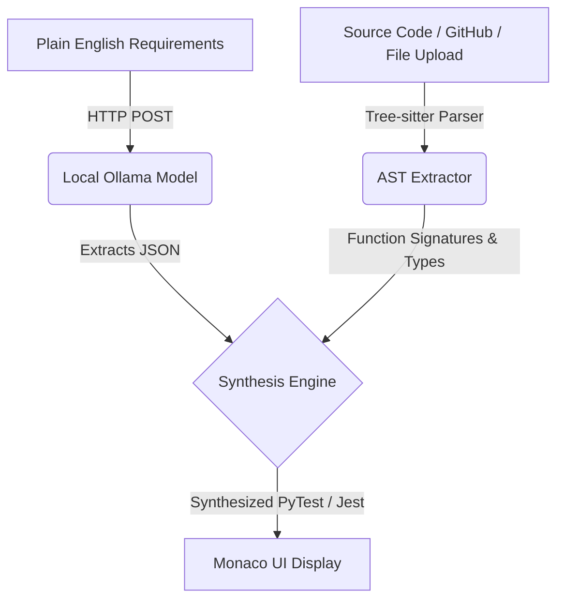

# 🛡️ Privacy-First AI Test Case Generator

[](#)
[](#)
[](#)
[](#)

---

> **A blazing-fast, 100% local, and deterministic test generation agent built for enterprise QA and Engineering teams.**

---

## 📖 Overview & High-Level Concept

When software teams write tests, they usually have to manually read a Jira ticket (requirements), look at their code, and write edge cases by hand. While cloud-based AI assistants can help automate this, enterprise companies frequently ban them because they do not want proprietary source code or sensitive business rules transmitted to third-party cloud servers. 

The **Privacy-First AI Test Case Generator** solves this by running **100% locally and securely**. It is a specialized, local-first development companion designed to synthesize complete unit and fuzz testing suites without compromising intellectual property. The application reads plain-English product requirements using a local AI model and structurally maps those requirements directly onto deterministic function signatures extracted straight from the source code.

At the core of the AI processing layer lies a robust local integration with **Ollama**. When requirements are supplied—whether they are simple bullet points, full Jira ticket descriptions, or plain-English specifications—the Flask backend sends structured instructions to local models, such as `gemma2`, `qwen2.5`, or `llama3`. Rather than risking timeouts or model-missing errors, the application features an intelligent, self-healing model discovery system. On startup, the backend automatically queries Ollama's active tags, dynamically fallback-targeting the first available local model if the default high-performance model has not yet been pulled, thereby ensuring bulletproof execution out-of-the-box.

---

## 🧬 Core Technical Architecture & Innovations

### 🔍 Deterministic AST Parsing Engine (Tree-sitter)
To complement the local AI, the system employs a mathematical **Tree-sitter AST engine** to inspect the structural layout of the source code. Rather than relying on fragile regular expressions or string splits, the backend traverses the formal AST nodes of the submitted code to programmatically target function declarations, parameter structures, arrow functions, and class methods in both Python and JavaScript. Using these formal signatures, the engine synthesizes mock argument lists guided by the chosen testing profile:
*   **Standard QA Profile:** Injects typical safe bounds, `null`/`None`, `0`, `[]`, and `{}`, verifying basic boundary parameters.
*   **Security Fuzzing Profile:** Generates hostile fuzzing matrices, targeting inputs with SQL injection (`' OR 1=1 --`), Cross-Site Scripting (XSS), massive strings, null byte injection, and buffer-overflow payloads to inspect safety thresholds.

### 🌐 Direct GitHub & File Scanning (New!)
To make codebase scanning effortless, the platform supports:
*   **Direct GitHub Scanning:** Enter any standard public GitHub file URL. The system automatically fetches raw code content via a secure backend proxy, performs vulnerability scans, and maps requirements instantly.
*   **Local File Uploads:** Upload and analyze local `.py`, `.js`, `.ts`, and `.tsx` source files directly through the browser.

### 🧠 Smart NL Heuristic Wrapper & Bypasses
The platform features an intelligent natural language wrapper. If a developer accidentally pastes a plain-text list of requirements into the code editor instead of the requirements pane, the server detects the plain-text pattern, moves the text to the correct processing channel, and runs the LLM parsing. When the AST parser reports that no formal functions were detected in the text, the compiler automatically synthesizes standalone, condition-based Jest or pytest modules (e.g., `class Test_StandaloneRequirements` or standalone `describe` blocks) matching the AI edge cases. Furthermore, if the code is analyzed as fully correct and safe, the generator does not block the outputs; it generates the full fuzz/edge-case tests while prepending a successful verification header confirming security coverage.

### 📊 Threat Badge & Glowing Consequence Flowcharts (New!)
Every generated test suite comes equipped with real-time AI security feedback. When vulnerabilities are detected, the system displays real-time security alerts along with a glowing, logical threat consequence flowchart (e.g., `Input Bypass ➔ Privilege Escalation ➔ Database Breach`), mapping out how vulnerabilities propagate through the execution stack.

### 🎨 Premium UI with Dual Theme Mode (New!)
Built as a unified production-ready monorepo, the frontend is built using **React, Vite, TailwindCSS, Lucide-React, and Monaco Editor** to deliver an IDE-like interface. It features:
*   **Dual Light/Dark Theme Switcher:** A vibrant, responsive toggle between HSL tailored visual palettes.
*   **Vibrant State Controllers & Interactive Toasts:** Glowing badges, visual flowcharts, and real-time toast alerts that keep the user fully aligned with local AI actions.
*   **Integrated Deployment:** The Flask backend serves these compiled static assets directly on the root path, simplifying configuration. With a pre-configured `render.yaml` template, the entire stack can be compiled and deployed to platforms like Render.com.

---

## 🏗️ Architecture Flowchart



---

## 🧬 Technical Innovations

- **Resilient Local AI (Ollama):** The backend auto-scans available models and always chooses the best fit, ensuring local test synthesis never fails—even if your preferred model is missing.
- **Deterministic AST Parsing (Tree-sitter):** Mathematically traverses the codebase for total test mapping accuracy (supports arrow/functions, classes, methods, and parameterization).
- **Intelligent Fuzzing:** Security profile builds hostile payload matrices—including SQLi, XSS, and buffer overflows—so you catch vulnerabilities before they ship.
- **Smart NL Heuristics:** Pasting a Jira ticket or requirements? The system routes non-code input through the LLM for robust, requirement-based test generation—no formatting required.
- **Unified Monorepo:** Easy to run, extend, and deploy. React frontend and Flask backend served from one stack.

---

## 🌐 Deployment

- **Frontend:** React + Vite + TailwindCSS + Monaco Editor for in-browser test writing and review.
- **Backend:** Python Flask powers code analysis, AST extraction, and AI orchestration; serves all static assets.
- **Deployment:** Includes `render.yaml` for instant zero-config deployment to [Render.com](https://render.com/) or your own infrastructure.

---

## 🚀 Quick Start

1. **Clone this repo:**
   ```bash
   git clone https://github.com/Janakiram-2005/Ai_testcase_generator.git
   cd Ai_testcase_generator
   ```

2. **Install dependencies:**
   - Backend: `cd backend && pip install -r requirements.txt`
   - Frontend: `cd frontend && npm install`

3. **Launch Ollama with your desired model (e.g., gemma2 or qwen2.5):**
   ```bash
   ollama run gemma2
   ```

4. **Run the backend:**
   ```bash
   cd backend
   python app.py
   ```

5. **Run the frontend:**
   ```bash
   cd frontend
   npm run dev
   ```

6. **Open your browser and start generating secure, local test suites!**

---

## 🤝 Contributing

We welcome issues, feature requests, and PRs! Open an issue or submit a PR to get started.

---

## 📧 Contact

Questions? Ideas? Reach out via Issues or Pull Requests!

---

> ❤️ Built for developers who care about privacy, speed, and code quality.
