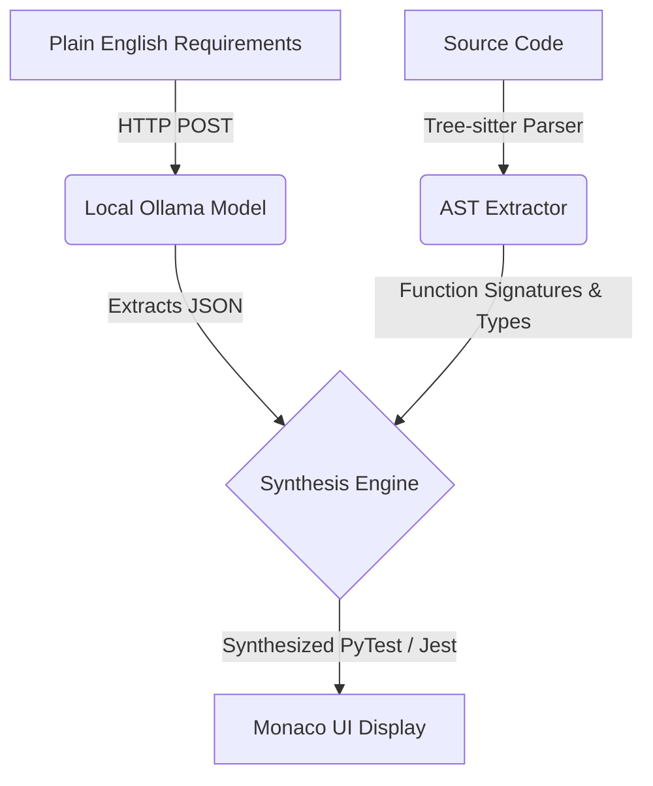

# 🛡️ Privacy-First AI Test Case Generator

[](#)
[](#)
[](#)
[](#)

---

> **A blazing-fast, 100% local, and deterministic test generation agent built for enterprise QA and Engineering teams.**

---

## 🛑 The Problem

Manual test case generation is slow, tedious, and error-prone. For enterprise teams, using cloud LLMs (like OpenAI or Claude) is risky or outright prohibited due to intellectual property concerns. Most AI coding assistants can even hallucinate function names, causing brittle, unreliable tests and broken builds.

---

## 💡 Our Solution

A **privacy-first**, 100% local test generation engine:
- **Zero Code Leaves Your Machine:** All logic runs locally. Only you see your code.
- **Deterministic Analysis:** Uses mathematical AST parsing (via **Tree-sitter**) to guarantee total accuracy and robust function mapping—**no more hallucinated test suites!**
- **Local AI:** Product requirements are analyzed using local models (run with Ollama) for robust, context-aware edge case extraction.

---

## ✨ Features

- 🔒 **Air-Gapped Privacy:** Never transmits your code anywhere. Requirements, code parsing, and test synthesis run fully locally.
- ⚡ **Universal Language Support:** Out-of-the-box support for **Python** (pytest) and **JavaScript/Node.js** (Jest) via Tree-sitter AST traversal.
- 🧠 **Local LLM-Driven Edge Case Extraction:** Paste requirements or Jira tickets, and the LLM extracts behavioral edge cases for instant test mapping.
- 🎯 **Intelligent Fuzzing Profiles:** Toggle between:
  - `Standard QA` (injects null, 0, empty, typical edge cases)
  - `Security` (injects SQLi, XSS, buffer overflow, massive strings)
- 💻 **IDE-Like UI:** Embedded Monaco Editor delivers a premium, dark-mode coding experience in the browser.
- 📥 **One-Click Exports:** Copy or download test suites as `.py` or `.js` files instantly.
- 🚑 **Self-Healing Backend:** Auto-detects installed Ollama models and gracefully falls back to the best available for robust local inference.
- 🏗️ **Production-Ready Deployment:** Easily deployable on Render or locally.

---

## 🏗️ Architecture



---

## 🧬 Technical Innovations

- **Resilient Local AI (Ollama):** The backend auto-scans available models and always chooses the best fit, ensuring local test synthesis never fails—even if your preferred model is missing.
- **Deterministic AST Parsing (Tree-sitter):** Mathematically traverses the codebase for total test mapping accuracy (supports arrow/functions, classes, methods, and parameterization).
- **Intelligent Fuzzing:** Security profile builds hostile payload matrices—including SQLi, XSS, and buffer overflows—so you catch vulnerabilities before they ship.
- **Smart NL Heuristics:** Pasting a Jira ticket or requirements? The system routes non-code input through the LLM for robust, requirement-based test generation—no formatting required.
- **Unified Monorepo:** Easy to run, extend, and deploy. React frontend and Flask backend served from one stack.

---

## 🌐 Deployment

- **Frontend:** React + Vite + TailwindCSS + Monaco Editor for in-browser test writing and review.
- **Backend:** Python Flask powers code analysis, AST extraction, and AI orchestration; serves all static assets.
- **Deployment:** Includes `render.yaml` for instant zero-config deployment to [Render.com](https://render.com/) or your own infrastructure.

---

## 🚀 Quick Start

1. **Clone this repo:**
   ```bash
   git clone https://github.com/Janakiram-2005/Ai_testcase_generator.git
   cd Ai_testcase_generator
   ```

2. **Install dependencies:**
   - Backend: `cd backend && pip install -r requirements.txt`
   - Frontend: `cd frontend && npm install`

3. **Launch Ollama with your desired model (e.g., gemma2 or qwen2.5):**
   ```bash
   ollama run gemma2
   ```

4. **Run the backend:**
   ```bash
   cd backend
   python app.py
   ```

5. **Run the frontend:**
   ```bash
   cd frontend
   npm run dev
   ```

6. **Open your browser and start generating secure, local test suites!**

---

## 🤝 Contributing

We welcome issues, feature requests, and PRs! Open an issue or submit a PR to get started.

---

## 📧 Contact

Questions? Ideas? Reach out via Issues or Pull Requests!

---

> ❤️ Built for developers who care about privacy, speed, and code quality.
